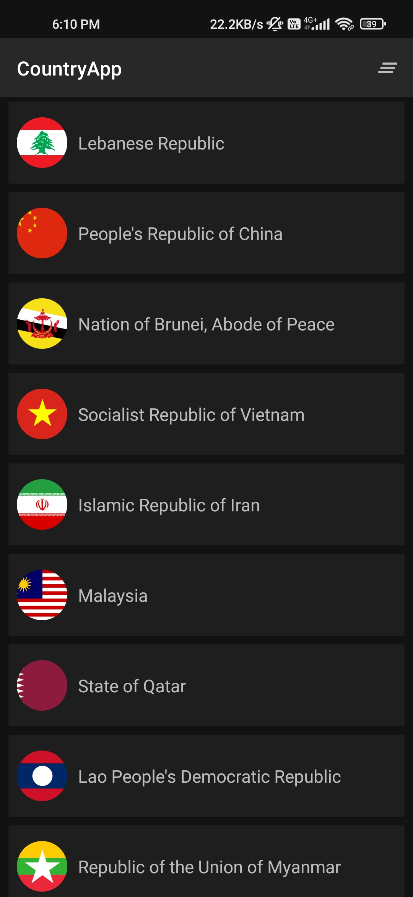
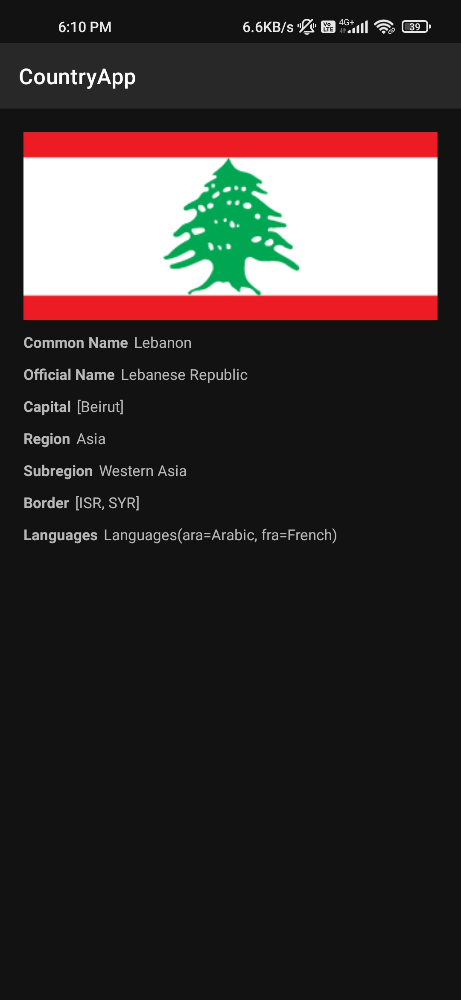
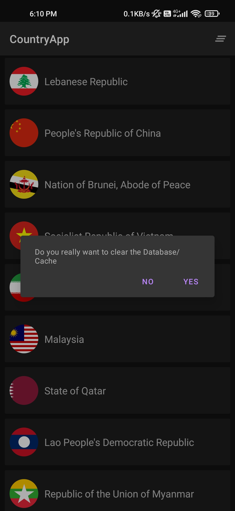

# AsianCountriesApp
App displays countries that are there in the asian region.
link : https://github.com/zeeshanmansoori/AsianCountriesApp/blob/master/assets/app-debug.apk

## Features
- MVI App Architecture.
- Navigation Component.
- Dependency injection with Hilt.
- Home page shows all the countries.
- Detail page displays name,flag,capital,region,subregion,borders & languages attributes.
- RestApi

## Libraries
- viewModel
- Dagger hilt
- Retrofit
- Glide
- Navigation
- Coroutines
- Room Database
- Kotlin Flow

## Result

### Dark Mode
|Home|Details|Action|
|-----------|-------------|-------------|
|  |  |  |

## Demo
|  |
|---------|

